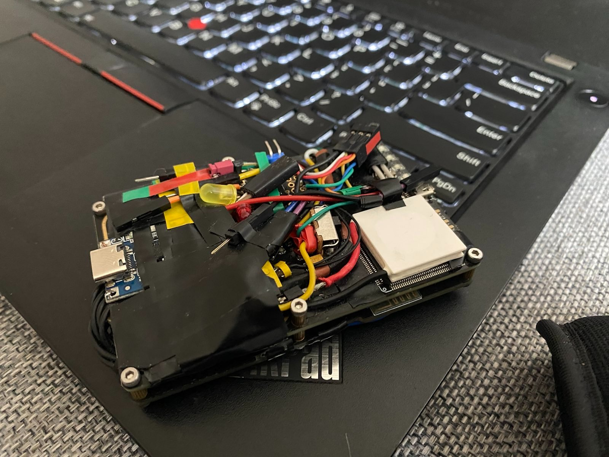
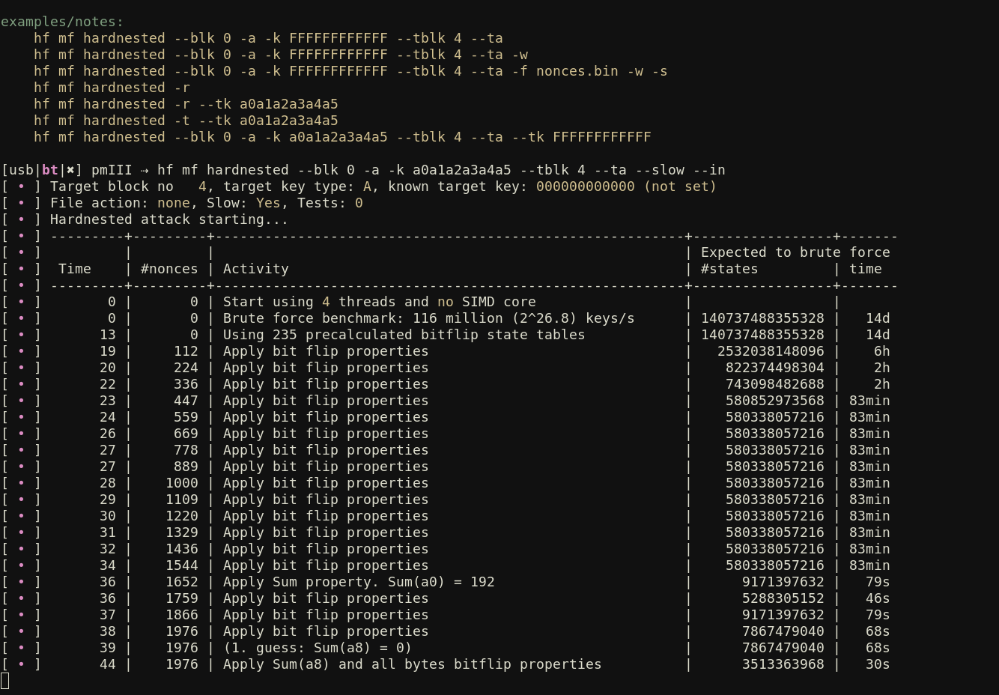

<h1 align="center">RedMark</h1>  

  <a>
     
    RedMark is a collection of our hardware, software (client) and firmware modifications to the Proxmark3 X RFID instrument.
  </a>

RedMark is a collection of our hardware, software (client) and firmware modifications to the Proxmark3 X RFID instrument.

### Motivation
When we saw all those idle and unused soldering pads on our device, we thought that they needed some attention.
Our 3 X model has all of the features of the RDv4, including SPIFFS, bluetooth communication, internal emulator and flash - we altered the source a little bit to enable maximum usage of this powerhouse.

### Hardware overview
This project consists of two separate devices joined together - the PM3 boards (BT + main board) and also a detachable PN532 unit, controlled via RPi PGA2040 placed on the top. The latter is used for performing some basic tasks whenever the main board is occupied by different, usually time-consuming operations.

### Software modifications
- New `hw` commands for checking the integrity of the device, BT addon status, transfer speed etc.
- More granular control over Mifare emulator, with support for blocks swapping, copying blocks, keys extraction/insertion and sector checks
- Tunable sensitivity of the `hw tune` command for HF antenna
- SAK/ATQA identifications helpers
- Multiple new scripts for both HF and LF operations
- Advanced plot window
- Script for integrations with Chameleon Mini (still WIP...)

### Compatibility
The firmware is compatible with all PM3 devices, both original and knock-offs.
A bash script that accompanies this project aids in the process of moving the firmware onto the device with no hassle. 
> NOTE: our software won't work under Windows, since it heavily relies on usage of bash scripting and requires USB connection, hence WSL will most likely won't work 
The source is based on the popular Iceman's repo and requires no external dependencies, except for `hcitools` package, which is used for BT reconnection in the `PMIII` shell script. (tested on Ubuntu 22.4 LTS, but should work on all major UNIX distros).

### Sanity checks
To flash full RDv4 firmware into a generic, knock-off device, we disabled most compiler checks that prevented the firmware to work as desired. Capabilities transmission and RSA signature checks have been modified so they no longer cause any issues when flashing to generics/clones (most likely that's the reason why it won't compile under Windows)

### Custom Plotter
![[./images/plotter.png]]
We have included a heavily modified version of the plot window, with more keyboard shortcuts, easier navigation,
better verbosity and plenty of UI changes.

### Gallery
| | | |
|:-------------------------:|:-------------------------:|:-------------------------:|
||  ||
|  |  ||
